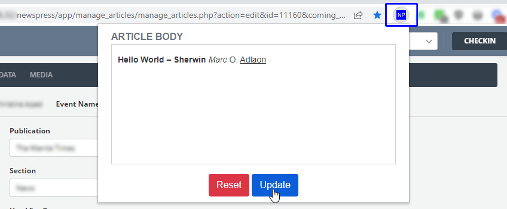
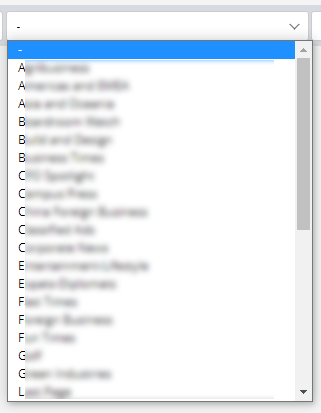
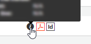

# NewsPublish Helper

A Google Chrome extension to copy and paste from Microsoft Word to NewsPublish
properly, among others.

Made for my lovely wife :)

## Features

#### Fixes malformed Microsoft Word content

On a create/edit page, click the `NP` button to paste into the `article body` field
the copied text from Microsoft Word properly.

Also removes any unnecessary content from the `title, subtitle` and `byline` fields.

#### Adds a `COPY` button

On any view/edit page, copy `title` and `article body` to the clipboard (to paste
into msword easily).

#### Removes transitions from modal boxes.

To render them a bit faster.

#### Alphabetizes the `Section` filter in the `Stories and Media` page.

#### Increases polling durations.

In the `Stories and Media, Page Management` and `Page Tracker` pages, increases
time between `"Loading..."` calls from 45 seconds to three minutes to minimize
chokings.

#### Disables article autosave.

On a create/edit page, disables autosave as there are instances that, depending
on the content, the article body becomes messed up after autosave triggers.

#### `Used For Page` (Article Flag) bugfix

On combined pages (e.g. `A1(A1-A2)`, `A2(A1-A2)`), the `Used For Page` dropdown
**WILL** also select the second entry (`A2(A1-A2)`) even if the article is really
meant for `A1(A1-A2)`. This fixes that.

#### Changes `preview` with `view` page.

In `Stories And Media,` previewing an article opens the `view` window instead of
the `preview` modal box to show the article with actual formatting.

#### Opens the hi-res image of the page in a new window.

In `Page Management` and even `Page Tracker` pages, clicking the `id` icon opens
the hi-res image of the page instead of the `Page Editor` for quick viewing.

#### Opens the Page Monitoring Log of the page in a new window.

In `Page Management` and even `Page Tracker` pages, clicking the `i` icon opens
the Page Monitoring Log of the page.

